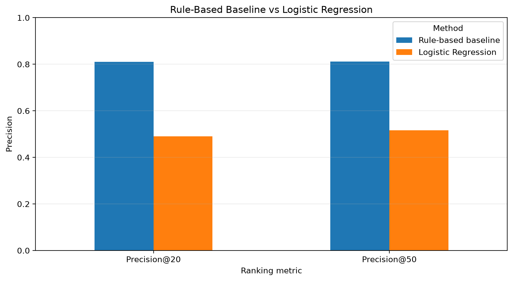

# Capstone Report — Refresh / Content Opportunity Scoring

- **Author:** Ege Gülünay
- **Lane:** Refresh / Content Opportunity Scoring
- **Repo:** FlyRank_AI_Internship
- **Date:** September 2026

## 0. Abstract

This project investigates how historical search-performance signals can be used to identify and rank content pages that are visible in search results but may be under-capturing clicks. The analysis uses the FlyRank ML Internship warehouse, with historical performance through March 31, 2026 used for decision-time features and April 2026 used for retrospective outcome evaluation. A transparent rule-based baseline was compared with Logistic Regression using five client-grouped validation folds and ranking metrics focused on the top of the review queue. In this evaluation, the rule-based baseline achieved mean Precision@20 of 81.0% and Precision@50 of 81.2%, compared with 49.0% and 51.6% for Logistic Regression. The resulting action playbook is intended to help SEO and content teams prioritize high-visibility, low-CTR pages for human review rather than automatically changing content.

## 1. Problem framing

SEO and content teams may manage large numbers of pages while having limited time available for manual review. The practical decision supported by this project is therefore:

**Which content pages should be reviewed first for a potential search-performance opportunity?**

The unit of analysis is an individual content page. The main output is a ranked opportunity queue that prioritizes pages using observed search-performance signals.

A human reviewer can use this queue to investigate pages with meaningful search visibility but unusually low click-through rate (CTR). The review may include the page title, meta description, SERP presentation, search-intent alignment, and other relevant editorial context.

The cost of a wrong recommendation is primarily wasted review effort or an unnecessary content change. A false positive could send an editor toward a page whose low CTR is reasonable because of search intent, seasonality, brand context, or other factors that are not represented by the available features.

Data-driven ranking is useful because manually reviewing every page is impractical. The objective is not to automate editorial decisions, but to use historical performance data to focus limited human-review capacity on larger observed opportunities first.

## 2. Data safety

The project uses the FlyRank ML Internship warehouse. The primary analytical source is `fact_content_daily_performance`.

Three time windows are used:

- **Previous-history window:** December 1, 2025 to February 28, 2026
- **Decision / feature window:** March 1 to March 31, 2026
- **Future outcome window:** April 1 to April 30, 2026

March 31 represents the decision point. Predictive features use only information available by that date. April performance is used only for retrospective outcome evaluation.

For the modeling evaluation, pages were required to have at least 20 GSC-available days in both March and April. This produced a retrospective evaluation population of **95,633 pages across 37 clients**.

Several fields were deliberately excluded from predictive features.

Pseudonymous client and content identifiers are used only for grouping, joining, and traceability. They are never used as model features. Label-derived fields such as `trend_direction` and `trend_pct` are excluded because they could introduce information related to the outcome definition.

The fixed `fact_content_query_90d` table is also excluded from March model features because its April 2 to June 30, 2026 window occurs after the March decision point. Using that table directly would introduce future information.

No client names, domains, URLs, private search queries, credentials, or other client-identifying information are included in the public analysis or report.

## 3. Baseline

A transparent rule-based baseline was developed before the machine-learning model.

The baseline targets a simple business pattern:

**high search visibility + good average position + unusually low CTR**

A page is considered a baseline candidate when:

- its March average search position is greater than 0 and at most 10;
- it has at least 500 March impressions; and
- its CTR is at or below the positive-CTR 25th-percentile threshold for its position bucket.

Candidate pages are ranked using:

`action_score = CTR gap × March impressions`

where `CTR gap` represents the difference between the position-based CTR threshold and the page's observed March CTR.

This baseline is intentionally simple and interpretable. It represents a reasonable business-informed approach that could be used without a machine-learning model, making it an appropriate comparison for evaluating whether additional modeling complexity improves the ranking.

Using the same five client-grouped validation folds as the Logistic Regression model, the baseline achieved:

- **Mean Precision@20: 81.0%**
- **Mean Precision@50: 81.2%**

The baseline therefore provided a strong reference point for the modeling stage.

## 4. Model / analysis

The machine-learning approach uses Logistic Regression to estimate an opportunity score for each eligible page.

The model uses 11 features available by the March 31 decision point:

1. March impressions per available day
2. March CTR
3. March average position
4. Previous-history impressions per available day
5. Previous-history CTR
6. Previous-history average position
7. CTR change
8. Position change
9. Impressions-per-day change
10. Previous-history GSC available days
11. Previous-history availability indicator

Missing numeric values are median-imputed and numeric features are standardized inside the modeling pipeline.

Client and content identifiers are intentionally excluded from the predictive feature set. Future April performance and the fixed April–June query-level table are also excluded.

The target is defined retrospectively using April performance. A page is labeled as an `opportunity` when it has an April average position greater than 0 and at most 10, at least 500 April impressions, and April CTR at or below the 25th percentile of positive CTR among eligible pages in positions 1–10.

This definition produced **12,273 positive opportunities among 95,633 eligible pages**, corresponding to a positive base rate of approximately **12.83%**.

Logistic Regression was selected as a simple and interpretable modeling approach rather than introducing unnecessary model complexity before establishing whether learned patterns improve on the transparent baseline.

## 5. Evaluation

Evaluation uses five-fold `StratifiedGroupKFold` cross-validation with `client_hash_id` as the grouping variable.

All pages belonging to the same client remain together within a fold. Therefore, the same client cannot appear in both the training and validation portions of a fold. This provides a more appropriate test of performance on unseen clients than ordinary row-level random splitting.

Precision@20 and Precision@50 are the primary metrics because the practical objective is not to classify every page correctly. The objective is to produce a small, high-quality review queue.

The opportunity base rate in the retrospective evaluation population is **12.83%**.

Both approaches were evaluated on the same client-grouped folds:

| Method | Mean Precision@20 | Mean Precision@50 |
|---|---:|---:|
| Rule-based baseline | 81.0% | 81.2% |
| Logistic Regression | 49.0% | 51.6% |



*Figure 1. Mean Precision@20 and Precision@50 for the rule-based baseline and Logistic Regression across the five client-grouped validation folds.*


The rule-based baseline therefore achieved higher top-of-queue precision in this evaluation.

The result should not be interpreted as evidence that rule-based methods are generally superior to machine-learning models. It is specific to this dataset, target definition, feature set, and validation design.

Error analysis also showed that the methods were not identical. Logistic Regression ranked some true opportunities in its top 50 that the explicit baseline rule did not select, while the baseline successfully prioritized other true opportunities that Logistic Regression ranked substantially lower. This suggests that the model may capture patterns beyond the explicit baseline rule, but those additional patterns did not produce stronger overall top-of-queue precision in the evaluation performed here.

## 6. Interpretation

The main result of the project is a negative modeling result with practical value: additional model complexity did not improve the primary ranking metrics over the transparent baseline.

The strongest observed opportunity pattern was already represented directly by the baseline: pages with substantial search visibility, relatively good positions, and unusually low CTR provide a useful group for prioritized investigation.

Historical trend features allowed Logistic Regression to consider changes in CTR, position, and impression volume in addition to the current March state. However, these additional learned relationships did not produce higher mean Precision@20 or Precision@50 than the business-informed baseline.

This is useful because the simpler method is easier to explain to an editor. A reviewer can directly understand why a page was prioritized instead of relying only on a model probability.

The result does not establish that trend information has no value. Logistic Regression identified some true opportunities that the baseline missed, indicating that the methods can capture partially different patterns. Further work could investigate whether those complementary signals improve a hybrid ranking strategy.

## 7. Recommendation

The validated rule-based approach is used as the primary foundation for the action playbook.

The main archetype is:

**`HIGH_VISIBILITY_LOW_CTR`**

Pages in this archetype receive:

- **Action:** `CTR_FIX`
- **Reason code:** `LOW_CTR_HIGH_VISIBILITY`
- **Recommended review:** inspect the title, meta description, SERP presentation, and search-intent alignment.

The `action_score` prioritizes pages with larger observed CTR gaps and higher impression volume, helping allocate limited human-review capacity toward larger observed opportunities first.

The score should not be interpreted as predicted additional clicks, monetary value, or guaranteed impact.

Performance decay can also be considered during human review as a reason to investigate whether a broader content refresh is appropriate. However, observed decay alone is not sufficient evidence for automatically refreshing a page.

The system should therefore remain a decision-support tool. It should not automatically rewrite, publish, delete, redirect, unpublish, or substantially modify content.

A FlyRank editor could use the ranked queue as a daily or weekly review list, inspect the surrounding business and search context, and then decide whether any editorial action is justified.

## 8. Reproducibility

The project is designed to be reproduced using the committed GitHub repository, Google Colab, and the FlyRank internship warehouse hosted on Hugging Face.

### Repository and environment

The complete analysis is stored in the project repository. The main Python dependencies are documented in `requirements.txt`:

- pandas >= 2.2
- numpy >= 1.26
- scikit-learn >= 1.4
- matplotlib >= 3.8
- reportlab >= 4.0
- duckdb >= 1.0
- huggingface_hub >= 0.24

The repository's official setup workflow uses Google Colab, so a local Python or Jupyter installation is not required to reproduce the notebooks.

### Data access

The analysis uses the gated `FlyRank/internship-warehouse` dataset hosted on Hugging Face.

Before running the warehouse-dependent notebooks:

1. Create a Hugging Face account.
2. Accept the access terms for `FlyRank/internship-warehouse`.
3. Create a Hugging Face token with **Read** permission.
4. Provide the token through the notebook prompt or Colab Secrets using the name `HF_TOKEN`.

The token must never be hardcoded into notebook cells or committed to the public repository.

### Re-running the analysis

From a fresh copy of the repository:

1. Open the repository on GitHub.
2. Open the required notebooks through their Colab links or through **File → Open notebook → GitHub** in Google Colab.
3. Provide `HF_TOKEN` when warehouse access is required.
4. Run the assignment notebooks in order.
5. Finish with:

`work/notebooks/capstone.ipynb`

For each notebook, use:

**Runtime → Run all**

The capstone notebook should execute from top to bottom without errors and reproduce the reported analysis outputs.

For users who prefer a local Python environment, the committed dependencies can also be installed with:

```bash
git clone https://github.com/EgeGln365/FlyRank_AI_Internship.git
cd FlyRank_AI_Internship
python3 -m venv .venv
source .venv/bin/activate
pip install -r requirements.txt
```

### Reproducibility settings

The main modeling configuration uses:

- `random_state=42`
- five-fold `StratifiedGroupKFold`
- grouping variable: `client_hash_id`
- median imputation for missing numeric values
- numeric feature standardization
- Logistic Regression with `max_iter=1000`

Client and content identifiers are used only for grouping, joining, and traceability. They are not used as predictive model features.

### Expected validation checks

A successful reproduction should recover the main validated project results:

- Eligible retrospective evaluation population: **95,633 pages**
- Positive opportunities: **12,273**
- Positive base rate: **12.83%**
- Unique clients: **37**
- Rule-based baseline mean Precision@20: **81.0%**
- Rule-based baseline mean Precision@50: **81.2%**
- Logistic Regression mean Precision@20: **49.0%**
- Logistic Regression mean Precision@50: **51.6%**

The primary model-versus-baseline figure is stored at:

`work/figures/capstone_baseline_vs_logreg.png`

The public repository must not contain credentials, Hugging Face tokens, client names, domains, URLs, private search queries, or private raw exports.

This project uses client-grouped cross-validation and does not claim a sealed or blind holdout evaluation.
## 9. Acknowledgments & data credit

Built on the [FlyRank ML Internship dataset](https://flyrank.ai).